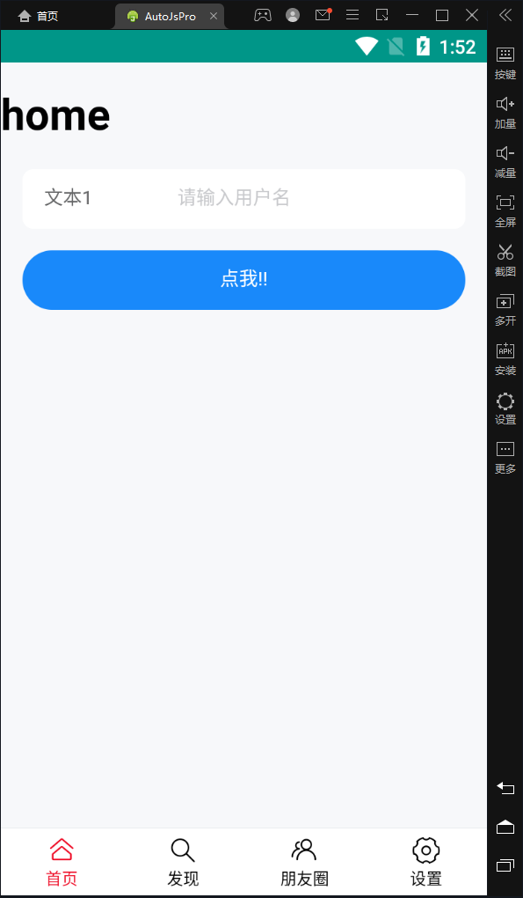
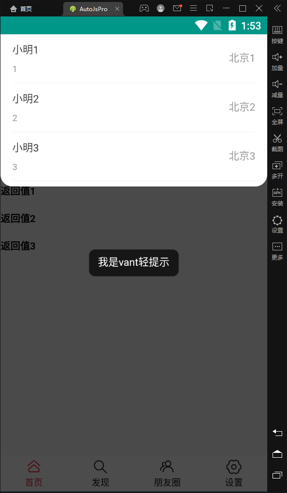
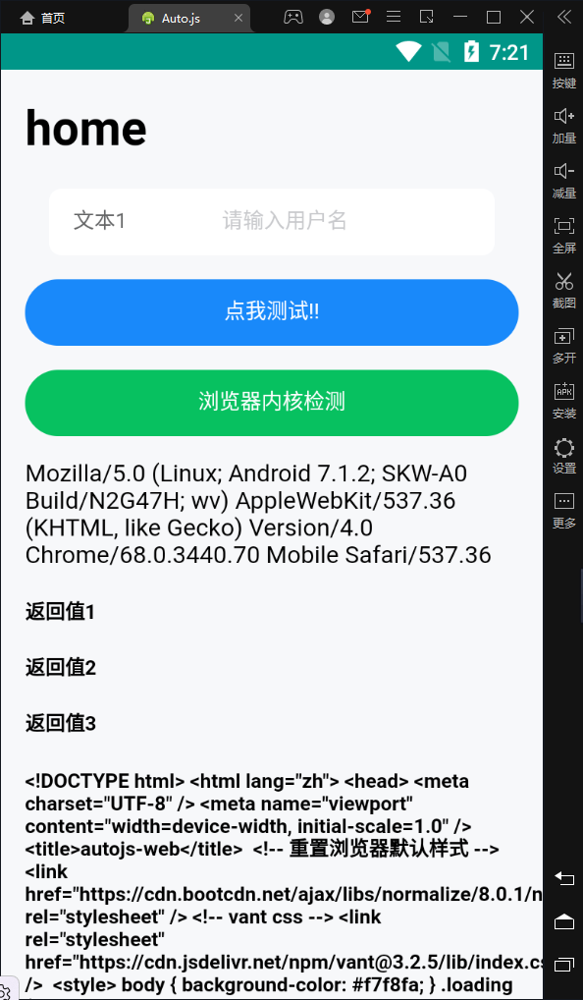
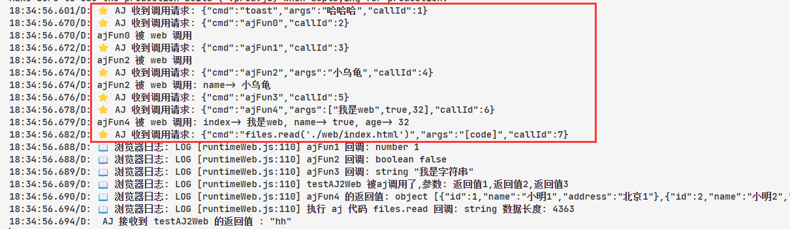

# autojs_web

> 使用 `html/css/js` 作为 autojs 的界面，可以互相通讯。
>
> 当然也可以用前端框架

## 分支说明

- v2.0 （当前分支）基于 `onConsoleMessage` 

- v1.0 基于 `onJsPrompt` (有点简陋,，完成度比较低，不过基本功能是有的)

## 适用范围
使用 `Rhino` 引擎的 auto.js 都能用 (包括 autoX 等等)

## 重要说明

由于 aj 会在打包的时候把所有 .js 文件进行加密, 

但 浏览器 无法识别这种加密,

所以浏览器端的 .js 需要改为 `.jsx` , 来跳过 aj 的加密. 

这样浏览器才能正确识别 js 代码

## 使用

在 VSCode 中 打开 `src` 目录，按 `Ctrl + Shift + P`，

选择 `运行项目(Run Project)` 命令，

Auto(X).js 插件会找 `根目录下的 Project.json`

代码中有例子 ( vue3 + vant )，可以直接进行测试。

### 一些例子和源码索引: (点击直接跳转)

#### 例子
[前端Web](https://github.com/xxxxue/autojs_web/blob/cdde5546e6bcec1fcc86cc7c61a8b9ec46a431d8/src/web/index.js#L46)

[后端AJ](https://github.com/xxxxue/autojs_web/blob/cdde5546e6bcec1fcc86cc7c61a8b9ec46a431d8/src/main.js#L23)

#### 框架
[Web](https://github.com/xxxxue/autojs_web/blob/cdde5546e6bcec1fcc86cc7c61a8b9ec46a431d8/src/runtime/runtimeWeb.js#L56) 

[AJ](https://github.com/xxxxue/autojs_web/blob/cdde5546e6bcec1fcc86cc7c61a8b9ec46a431d8/src/runtime/runtimeAj.js#L104)

## 灵感来源

这一套逻辑的灵感来源于 [AutoX.js 示例](https://github.com/kkevsekk1/AutoX/blob/6.2.7/app/src/main/assets/sample/Web%E6%89%A9%E5%B1%95%E4%B8%8E%E6%B8%B8%E6%88%8F%E7%BC%96%E7%A8%8B/AutoX%E6%B3%A8%E5%85%A5webview.js)

但 示例 中有许多不完美的地方 和 bug 

比如 AutoX 中是创建了一个 iframe 并拦截 `shouldOverrideUrlLoading` 事件

这个事件经过测试是 无法并发响应, 

比如 在一个按钮点击事件中 顺序调用多个`invoke`, 只有最后一个会生效,

前面的几个调用都没有任何反应.

所以改为 拦截 `onConsoleMessage` 也就是 `console.log` 事件

这样就支持了 并发响应,

然后 再优化 亿点代码. 最终就有了这个新版.

## 未来

如果有大佬可以基于这个架构搞一搞 Webpack

做到类似 [Wails](https://github.com/wailsapp/wails) 那样的 自动生成 `d.ts` 和 js 方法, 

再加上 Web前端现有的 `React`、`VSCode`、`TSX`、`Webpack` 、`热更新` 等等

那编程体验真的就太爽了.

（😭 我太菜了，目前还不会 webpack）

## 截图

## 联系方式

> QQ : 1659809758

# 支持作者

如果这个开源项目 可以帮助到你, 你也可以请作者吃一包辣条。

